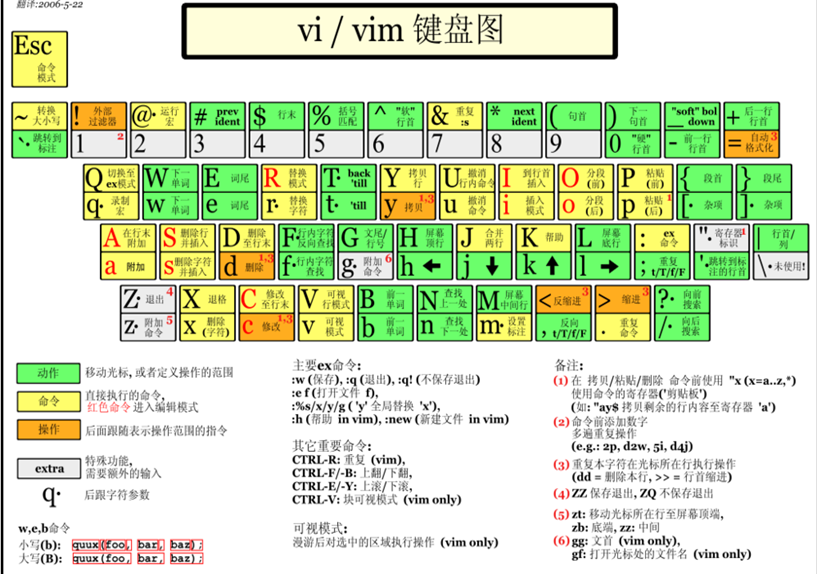

# VIM使用

* [常用快捷键](#常用快捷键)
* [替换](#替换)

## 常用快捷键

键位 | 功能
--- | ---
h | 光标左移
j | 光标下移
k | 光标上移
l | 光标右移
&lt;Esc&gt; | 回到normal模式
i | 在光标当前插入，insert
a | 在光标后插入，append
o | 在当前一行下插入新的空行
v | 进入visual模式
d | 剪切
dd | 剪切当前行(包括换行符)
x | 剪切一个字符
y | 复制
yy | 赋值一整行
p | 粘贴
ddp | 交换上下行(实际就是剪切一行然后粘贴)
&lt;C-f&gt; | 向下翻页
&lt;C-b&gt; | 向上翻页
&lt;C-d&gt; | 向下翻半页
&lt;C-u&gt; | 向上翻半页
G | 移动到最后一行
gg | 移动到第一行
0 | 到行首
$ | 到行尾
&gt;&gt; | 整行向右缩进
&lt;&lt; | 整行向左缩进

参考下图



## 替换

s表示当前行替换, %s表示全部行

/a/b 表示将a替换成b支持正则表达式

最后以/g结尾表示全部替换, 否则表示只替换第一个

:1,3表示行的范围

示例

```
:s/a/b/ | 将当前行第一个a替换为b

:s/a/b/g | 将当前行的所有a替换为b

:%s/a/b | 将每行第一个a替换为b

:%s/a/b/g | 将整个文件的所有a替换为b

:1,3s/a/b/ | 将1至3行的第一个a替换为b

:1,3s/a/b/g | 将1至3行的所有a替换为b

```


